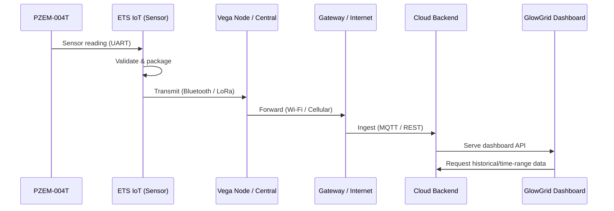

# Data flow

This document describes the step-by-step data flow from measurement to dashboard visualization.

## Step flow (conceptual)
1. PZEM-004T measures electrical parameters.
2. ETS IoT reads values via UART.
3. ETS IoT validates and packages telemetry.
4. ETS IoT transmits via Bluetooth or LoRa.
5. Receiver node (Vega / central) collects and aggregates.
6. Central node forwards data to cloud (MQTT / HTTPS).
7. Backend stores the data in a database.
8. GlowGrid dashboard fetches and displays live and historical data.

## Mermaid representation

TODO
- Add sequence diagrams for failure/retry paths and reconnection flows.
