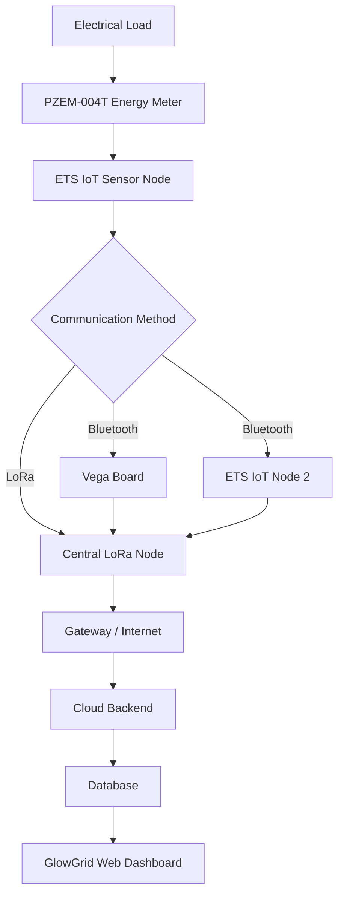

# System architecture

This document describes the conceptual architecture and recommended node responsibilities.

## High-level components
- Sensor Node (ETS IoT + PZEM)
- Vega / Receiver Node
- Central Node / Gateway
- Cloud Backend (API / DB / Analytics)
- GlowGrid Web Dashboard

## Conceptual flow (Mermaid)

## Notes
- The architecture should be flexible: keep Bluetooth, LoRa, and direct Internet options configurable.
- The Central Node performs aggregation, validation, node identification, and forwarding.

TODO
- Add a network topology drawing (PNG / SVG) in diagrams/ once hardware selection final.
